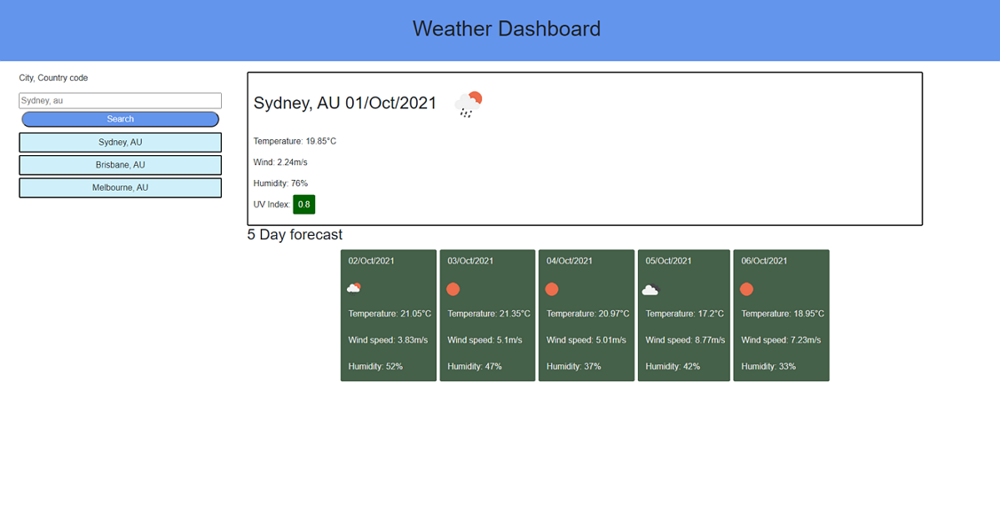

# Weather Dashboard


This application shows the user current weather and a 5 day forecast. [Link to deployed site](https://gitme-waffles.github.io/weather-dashboard/)
```
Each city searched is saved with it's counrty code to local storage (8 max, oldest search in the list is discarded) and listed under the search bar. (the counrty code specifies the city for the user)
When a saved city is clicked, the weather data for that city is called and displayed.
```
* Weather data displayed is metric
* UV index background colour changes according to UV set by the [Australian Bureau of Meteorology](http://www.bom.gov.au/nsw/uv/sydney.shtml) with Purple, Red, Orange, Yellow and Green

